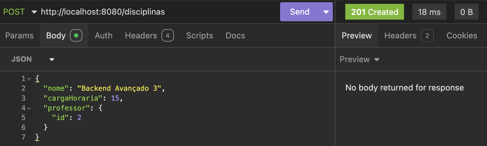
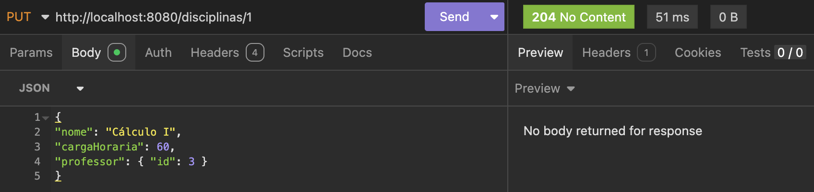

# API Aluno Online

API REST desenvolvida com Spring Boot para gerenciamento de Aluno, Professor, Disciplina e Matrícula, com operações completas de CRUD para as entidades.

## 1. Explicacao do projeto

Este projeto implementa o back-end de um sistema academico simples, com foco em:

- Cadastro de alunos
- Consulta de alunos
- Atualizacao de alunos
- Remocao de alunos
- Cadastro de professores
- Consulta de professores
- Atualizacao de professores
- Remocao de professores
- Cadastro de disciplinas
- Matrículas de alunos em disciplinas (nota e status)

A API persiste os dados em banco PostgreSQL utilizando Spring Data JPA.

## 2. Tecnologias utilizadas

- Java 21
- Spring Boot 4.0.3
- Spring Web MVC
- Spring Data JPA
- PostgreSQL
- Lombok
- Maven

## 3. Arquitetura utilizada

A aplicacao segue uma arquitetura em camadas:

- **Controller**: recebe as requisicoes HTTP e retorna as respostas
- **Service**: contem a logica de negocio
- **Repository**: acesso ao banco via JPA
- **Model**: entidades mapeadas para tabelas

Fluxo da requisicao:

1. Cliente envia request HTTP para um endpoint
2. Controller recebe e delega para o Service
3. Service aplica regras e chama o Repository
4. Repository executa operacoes no banco
5. Resultado volta para Service e Controller
6. Controller retorna a response HTTP

## 4. Estrutura do projeto

```text
src/main/java/br/com/alunoonline/api/
  AlunoOnlineApplication.java
  Controller/
    AlunoController.java
    ProfessorController.java
    DisciplinaController.java
    MatriculaAlunoController.java
  service/
    AlunoService.java
    ProfessorService.java
    DisciplinaService.java
    MatriculaAlunoService.java
  repository/
    AlunoRepository.java
    ProfessorRepository.java
    DisciplinaRepository.java
    MatriculaAlunoRepository.java
  model/
    Aluno.java
    Professor.java
    Disciplina.java
    MatriculaAluno.java
    MatriculaAlunoStatusEnum.java
  dtos/
    AtualizarNotasRequestDTO.java

src/main/resources/
  application.properties
```

## 5. Detalhamento do codigo

### 5.1 Entidades (Model)

#### Aluno

Tabela: `aluno`

Campos:

- id (Long, chave primaria, auto incremento)
- nomeCompleto (String)
- matricula (String)
- cpf (String)
- email (String)

#### Professor

Tabela: `professor`

Campos:

- id (Long, chave primaria, auto incremento)
- nomeCompleto (String)
- cpf (String)
- email (String)

#### Disciplina

Tabela: `disciplina`

Campos:

- id (Long, chave primaria, auto incremento)
- nome (String)
- codigo (String)
- cargaHoraria (Integer)

#### Matricula (MatriculaAluno)

Tabela: `matricula_aluno`

Campos:

- id (Long, chave primaria, auto incremento)
- aluno_id (Long, chave estrangeira para `aluno`)
- disciplina_id (Long, chave estrangeira para `disciplina`)
- nota (Decimal/Double)
- status (Enum `MatriculaAlunoStatusEnum`)

#### MatriculaAlunoStatusEnum

Enum usado no campo `status` da entidade `MatriculaAluno`.

Possiveis valores:

- `MATRICULADO` — aluno matriculado na disciplina
- `APROVADO` — aluno aprovado na disciplina
- `REPROVADO` — aluno reprovado na disciplina
- `TRANCADO` — matricula trancada

### 5.2 Repositories

- `AlunoRepository extends JpaRepository<Aluno, Long>`
- `ProfessorRepository extends JpaRepository<Professor, Long>`
- `DisciplinaRepository extends JpaRepository<Disciplina, Long>`
- `MatriculaAlunoRepository extends JpaRepository<MatriculaAluno, Long>`

### 5.3 Services

#### AlunoService

Responsavel por:

- criar aluno
- listar todos os alunos
- buscar aluno por id
- deletar aluno por id
- atualizar aluno por id

#### ProfessorService

Responsavel por:

- criar professor
- listar todos os professores
- buscar professor por id
- deletar professor por id
- atualizar professor por id

#### DisciplinaService

Responsavel por:

- criar disciplina
- listar todas as disciplinas
- buscar disciplina por id
- deletar disciplina por id
- atualizar disciplina por id

#### MatriculaAlunoService

Responsavel por:

- matricular aluno em disciplina
- listar matriculas
- buscar matricula por id
- atualizar nota/status da matricula
- deletar matricula por id

### 5.4 Controllers e endpoints

Base URL local:

```text
http://localhost:8080
```

Controllers disponiveis:

- `AlunoController`
- `ProfessorController`
- `DisciplinaController`
- `MatriculaAlunoController`

---

## 6. CRUD completo de Aluno

### 6.1 Criar Aluno

- Metodo: `POST`
- Endpoint: `/alunos`
- Status de sucesso: `201 Created`

Body exemplo:

```json
{
  "nomeCompleto": "Maria Silva",
  "matricula": "20260001",
  "cpf": "12345678900",
  "email": "maria.silva@exemplo.com"
}
```

### 6.2 Listar todos os Alunos

- Metodo: `GET`
- Endpoint: `/alunos`
- Status de sucesso: `200 OK`

Resposta exemplo:

```json
[
  {
    "id": 1,
    "nomeCompleto": "Maria Silva",
    "matricula": "20260001",
    "cpf": "12345678900",
    "email": "maria.silva@exemplo.com"
  }
]
```

### 6.3 Buscar Aluno por ID

- Metodo: `GET`
- Endpoint: `/alunos/{id}`
- Status de sucesso: `200 OK`

Resposta exemplo:

```json
{
  "id": 1,
  "nomeCompleto": "Maria Silva",
  "matricula": "20260001",
  "cpf": "12345678900",
  "email": "maria.silva@exemplo.com"
}
```

### 6.4 Atualizar Aluno por ID

- Metodo: `PUT`
- Endpoint: `/alunos/{id}`
- Status de sucesso: `204 No Content`

Body exemplo:

```json
{
  "nomeCompleto": "Maria Silva Atualizada",
  "matricula": "20260001",
  "cpf": "12345678900",
  "email": "maria.atualizada@exemplo.com"
}
```

### 6.5 Deletar Aluno por ID

- Metodo: `DELETE`
- Endpoint: `/alunos/{id}`
- Status de sucesso: `204 No Content`

---

## 7. CRUD completo de Professor

### 7.1 Criar Professor

- Metodo: `POST`
- Endpoint: `/professores`
- Status de sucesso: `201 Created`

Body exemplo:

```json
{
  "nomeCompleto": "Carlos Mendes",
  "cpf": "98765432100",
  "email": "carlos.mendes@exemplo.com"
}
```

### 7.2 Listar todos os Professores

- Metodo: `GET`
- Endpoint: `/professores`
- Status de sucesso: `200 OK`

Resposta exemplo:

```json
[
  {
    "id": 1,
    "nomeCompleto": "Carlos Mendes",
    "cpf": "98765432100",
    "email": "carlos.mendes@exemplo.com"
  }
]
```

### 7.3 Buscar Professor por ID

- Metodo: `GET`
- Endpoint: `/professores/{id}`
- Status de sucesso: `200 OK`

Resposta exemplo:

```json
{
  "id": 1,
  "nomeCompleto": "Carlos Mendes",
  "cpf": "98765432100",
  "email": "carlos.mendes@exemplo.com"
}
```

### 7.4 Atualizar Professor por ID

- Metodo: `PUT`
- Endpoint: `/professores/{id}`
- Status de sucesso: `204 No Content`

Body exemplo:

```json
{
  "nomeCompleto": "Carlos Mendes Atualizado",
  "cpf": "98765432100",
  "email": "carlos.atualizado@exemplo.com"
}
```

### 7.5 Deletar Professor por ID

- Metodo: `DELETE`
- Endpoint: `/professores/{id}`
- Status de sucesso: `204 No Content`

---

## 8. CRUD completo de Disciplina

### 8.1 Criar Disciplina

- Metodo: `POST`
- Endpoint: `/disciplinas`
- Status de sucesso: `201 Created`

Body exemplo:

```json
{
  "nome": "Algoritmos e Estruturas de Dados",
  "codigo": "ADS101",
  "cargaHoraria": 60
}
```

### 8.2 Listar todas as Disciplinas

- Metodo: `GET`
- Endpoint: `/disciplinas`
- Status de sucesso: `200 OK`

Resposta exemplo:

```json
[
  {
    "id": 1,
    "nome": "Algoritmos e Estruturas de Dados",
    "codigo": "ADS101",
    "cargaHoraria": 60
  }
]
```

### 8.3 Buscar Disciplina por ID

- Metodo: `GET`
- Endpoint: `/disciplinas/{id}`
- Status de sucesso: `200 OK`

Resposta exemplo:

```json
{
  "id": 1,
  "nome": "Algoritmos e Estruturas de Dados",
  "codigo": "ADS101",
  "cargaHoraria": 60
}
```

### 8.4 Atualizar Disciplina por ID

- Metodo: `PUT`
- Endpoint: `/disciplinas/{id}`
- Status de sucesso: `204 No Content`

Body exemplo:

```json
{
  "nome": "Algoritmos Avancados",
  "codigo": "ADS201",
  "cargaHoraria": 80
}
```

### 8.5 Deletar Disciplina por ID

- Metodo: `DELETE`
- Endpoint: `/disciplinas/{id}`
- Status de sucesso: `204 No Content`

---

## 9. CRUD completo de Matrícula (MatriculaAluno)

### 9.1 Criar Matrícula

- Metodo: `POST`
- Endpoint: `/matriculas`
- Status de sucesso: `201 Created`

Body exemplo:

```json
{
  "alunoId": 1,
  "disciplinaId": 1,
  "nota": 0.0,
  "status": "MATRICULADO"
}
```

### 9.2 Listar Matrículas

- Metodo: `GET`
- Endpoint: `/matriculas`
- Status de sucesso: `200 OK`

Resposta exemplo:

```json
[
  {
    "id": 1,
    "alunoId": 1,
    "disciplinaId": 1,
    "nota": 7.5,
    "status": "APROVADO"
  }
]
```

### 9.3 Buscar Matrícula por ID

- Metodo: `GET`
- Endpoint: `/matriculas/{id}`
- Status de sucesso: `200 OK`

### 9.4 Atualizar Nota/Status da Matrícula

- Metodo: `PUT`
- Endpoint: `/matriculas/{id}`
- Status de sucesso: `204 No Content`

Body exemplo (DTO `AtualizarNotasRequestDTO`):

```json
{
  "matriculaId": 1,
  "nota": 8.5
}
```

### 9.5 Deletar Matrícula por ID

- Metodo: `DELETE`
- Endpoint: `/matriculas/{id}`
- Status de sucesso: `204 No Content`

---

## 10. Configuracao do banco de dados (PostgreSQL)

Arquivo: `src/main/resources/application.properties`

Configuracoes atuais:

```properties
spring.datasource.url=jdbc:postgresql://localhost:5432/aluno_online
spring.datasource.username=coloque seu banco aqui
spring.datasource.password=coloque sua senha aqui
spring.datasource.driver-class-name=org.postgresql.Driver
spring.jpa.database-platform=org.hibernate.dialect.PostgreSQLDialect
spring.jpa.hibernate.ddl-auto=update
spring.jpa.show-sql=true
```

## 11. Como executar o projeto

### 11.1 Pre-requisitos

- Java 21 instalado
- Maven instalado (ou usar o wrapper `./mvnw`)
- PostgreSQL ativo com banco `aluno_online` criado

### 11.2 Passo a passo

1. Ajuste usuario e senha no arquivo `application.properties`
2. Abra o terminal na raiz do projeto
3. Execute o comando:

```bash
./mvnw spring-boot:run
```

4. A API estara disponivel em:

```text
http://localhost:8080
```

## 12. Prints das requisicoes feitas no Insomnia

Capturas realizadas com sucesso (status HTTP validos para cada operacao).

### 12.1 Aluno

- Criar aluno (POST /alunos)
  - Status: `201 Created`


- Listar alunos (GET /alunos)
  - Status: `200 OK`


- Buscar aluno por ID (GET /alunos/{id})
  - Status: `200 OK`


- Atualizar aluno (PUT /alunos/{id})
  - Status: `204 No Content`


- Deletar aluno (DELETE /alunos/{id})
  - Status: `204 No Content`


### 12.2 Professor

- Criar professor (POST /professores)
  - Status: `201 Created`


- Listar professores (GET /professores)
  - Status: `200 OK`


- Buscar professor por ID (GET /professores/{id})
  - Status: `200 OK`


- Atualizar professor (PUT /professores/{id})
  - Status: `204 No Content`


- Deletar professor (DELETE /professores/{id})
  - Status: `204 No Content`


### 12.3 Disciplina

- Criar disciplina (POST /disciplinas)
  - Status: `201 Created`



- Listar disciplinas (GET /disciplinas)
  - Status: `200 OK`


- Buscar disciplina por ID (GET /disciplinas/{id})
  - Status: `200 OK`


- Atualizar disciplina (PUT /disciplinas/{id})
  - Status: `204 No Content`



- Deletar disciplina (DELETE /disciplinas/{id})
  - Status: `204 No Content`


### 12.4 Matrícula

- Criar matrícula (POST /matriculas)
  - Status: `201 Created`


- Atualizar nota matrícula (PUT /matriculas/{id})
  - Status: `204 No Content`


- Trancar matrícula (PUT/POST /matriculas/trancar)
  - Status: `204 No Content`


---

## 13. Prints do DBeaver (tabelas e dados usados nos testes)

Capturas realizadas mostrando as tabelas usadas nos testes.

- Tabela aluno


- Tabela professor


- Tabela disciplina


- Tabela matricula


## 14. Autor

Projeto desenvolvido para a disciplina de Back-end (UNIESP).
